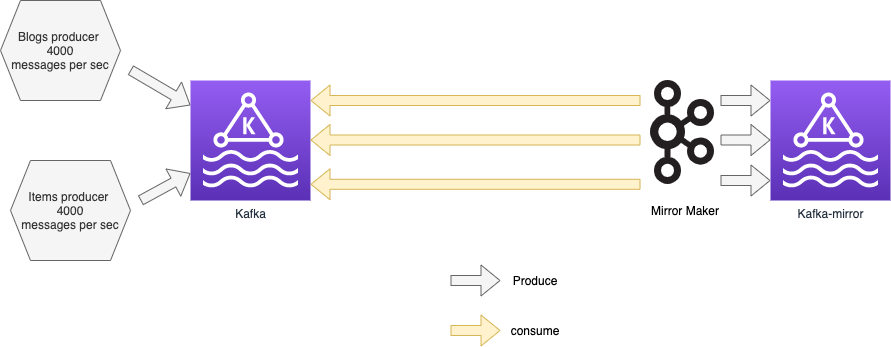

# Kafka backup with Kasten 


Demonstrate 2 different approaches for backing up a Kafka cluster with Kasten : 
*   Hot snapshot backup using Kasten 
*   Application consistent backup using mirror maker and Kasten with kanister blueprint 

This labs is deployed on openshift 4.6 on Azure and we extensivly use the Strimzi operator 
to manage the kafka clusters and kafka mirror maker 2.

## Install the kafka operator

Go on Operator hub > Strimzi > install in all namespaces, which will install on the openshift-opertors namespace.

For this presentation we used the 0.23.0 version of strimzi.

## A cluster and a mirror cluster 



We mirror the primary cluster. This setting is very important and allow us to : 
*   Validate that a restore does not lose data because we have a mirror to compare
*   Provide an application consistent method for backing up kafka by operating the 
backup on the mirror rather than on the primary

## Three test-plan  

For each parts we created a [video](videos/) to illustrate the detailed information 
that you will find in each test plan.

### 1. Setting up the env 

In this [part](test-plan/01_kafka-mirror-producers.md) we install the env and introduce the 
different scripts that we'll use to control and compare the topics : 
* [recreate_env.sh](recreate_env.sh) re-initialise the whole environment 
* [count_message_per_seconds.sh](count_message_per_seconds.sh) count the number of message 
sent to a topic in one second
* [read_last_10_messages.sh](read_last_10_messages.sh) show the messages at the head of a topic
* [compare_topic.sh](compare_topic.sh) the most important script as it help us to check that we do not 
lose messages during the different operations.

### 2. Hot snapshot 

In this [part](test-plan/02_hot-snapshot-restored.md) we show that when taking a hot snapshot 
with kasten and restore it, the head is not anymore application consistent, even if there is 
no data loss at the tail level. 

Blogs topic before snap :
```
Partition 0: ---------------------------
Partition 1: ---------------------------
Partition 2: ---------------------------
```

Blogs topic snapshotted :
```
Partition 0: ---------------------------
                                       ^ capture at time                                     
Partition 1: ---------------------------
                                      ^ capture at time but last segment not flushed
Partition 2: ------------------------------
                                          ^ capture at time + epsilon because even if snap are scheduled in 
                                          the same time storage may not be immediatly available for snap
```


Blogs topic restored :
```
Partition 0: ---------------------------
Partition 1: --------------------------
Partition 2: ------------------------------
```

### 3. Application consistent backup 

In this [part](test-plan/03_app-consistent-snap-restored.md) we run the backup on 
the mirror not on the source itself. But we are able to perform operation that 
can't be done on the primary like : 
*   Stop all mirrormaker productions before snapshot 
*   Call sync to flush all file to the disk 
*   Stop the brokers and zookeepers before snapshot
*   Restart the brokers and zookeepers after snapshot
*   Restart mirrormaker production after snapshot 

We show that with this method the restored topic has its head also application consistent.